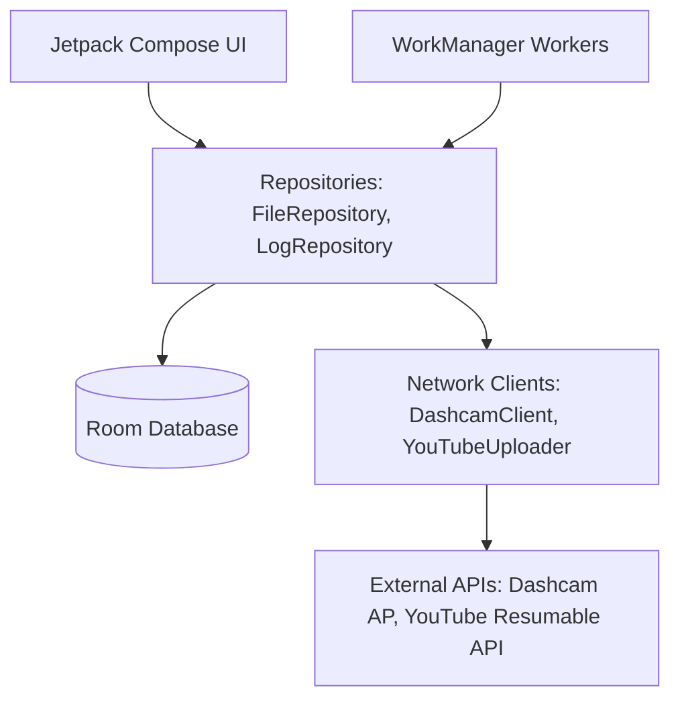

# uDash 🚗🎥 

[](https://developer.android.com)
[](https://kotlinlang.org)
[](https://developer.android.com/jetpack/compose)
[](LICENSE)

**uDash** is a fully automated background sync-and-upload companion app designed for **DDPAI dashcams**. It runs silently in the background, automatically detects your dashcam's Wi-Fi network, downloads new recordings, and uploads them seamlessly to a private YouTube playlist. 

Designed for hands-free security and archiving, uDash ensures you never lose a foot of dashcam footage.

---

## ✨ Features

- 🔋 **Zero-Touch Automation:** Automatically triggers syncing logic whenever the phone connects to the dashcam's AP (e.g., when you start your car).
- 🔄 **YouTube Resumable Uploads:** Utilizes YouTube's Chunked Resumable Upload protocol to handle large video uploads gracefully, resuming uploads from where they left off even across connection drops.
- 🛡️ **Double-Gate Integrity Check:** Excludes corrupted recordings using two validation steps:
  - **MP4 Atom Scanner:** An ultra-fast local Kotlin scanner verifying structural integrity (`ftyp`, `mdat`, and `moov` presence) before dispatch.
  - **FFprobe Verification:** Leverages a lightweight community-maintained FFmpeg build as a secondary sanity gate check.
- 📶 **Bound HTTP Client:** Forces requests directly through the dashcam's cellular/Wi-Fi network interface, avoiding Android gateway resolution issues when the dashcam Wi-Fi has no internet access.
- 🎨 **Sleek Cyberpunk Dashboard:** A premium, dark-mode terminal user interface showing live network speed, queue progress, diagnostic status, and raw device logs.

---

## 🛠️ Tech Stack

- **UI Framework:** Jetpack Compose (Material 3)
- **Background Pipeline:** WorkManager (CoroutineWorker & Foreground Service)
- **Database:** Room (SQLite) with reactive Flows
- **Network Stack:** OkHttp & AppAuth (OAuth 2.0 authorization)
- **Video Verification:** FFmpegKit (via community-maintained `dev.ffmpegkit-maintained`)
- **JSON Engine:** Google GSON

---

## 🏗️ Architecture

uDash is designed with **Clean Architecture** patterns:



- **Data Layer:** Handles network socket bindings to bypass standard gateway routing, SQLite persistence, and OAuth session tokens.
- **Domain Layer:** Manages states (Pending, Downloading, Downloaded, Uploading, Uploaded, Failed) and execution queues.
- **UI Layer:** Responsive dashboard built using state-hoisting Compose design principles.

---

## 🚀 Getting Started

### Prerequisites
- **Android Studio** Ladybug or newer.
- **JDK 17 / 21** configured on your local machine.

### Installation & Configuration

1. **Clone the Repository:**
   ```bash
   git clone https://github.com/your-username/uDash.git
   cd uDash
   ```

2. **Set up Google Cloud Console (YouTube API):**
   - Create a project on the [Google Cloud Console](https://console.cloud.google.com/).
   - Enable the **YouTube Data API v3**.
   - Create an **OAuth 2.0 Client ID** for Android.
   - Configure your Client ID and redirect URI inside the app configuration menu or update the default parameters in the application class.

3. **Compile & Run:**
   Build and deploy the application on your Android device using Android Studio or the CLI:
   ```bash
   ./gradlew assembleDebug
   ```

---

## 🔒 Security & Privacy

- **Local Storage:** All video cache and database entries are stored securely on-device.
- **Cleartext Restrictions:** Network configurations strictly whitelist local HTTP cleartext traffic to the dashcam gateway `193.168.0.1` while keeping general API traffic SSL-encrypted.
- **Scope Limitation:** OAuth configurations request the minimum required scopes for uploading videos.

---

## 📄 License

This project is licensed under the MIT License. See [LICENSE](LICENSE) for details.
