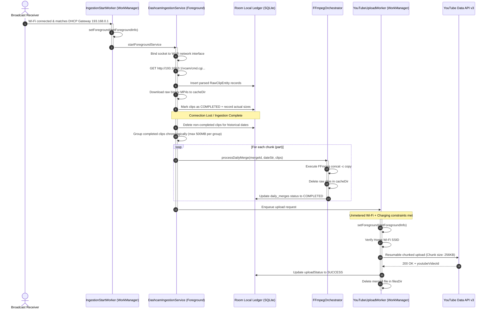

# Walkthrough: uDash Autonomous ETL & YouTube Upload Pipeline Fixes

This document details the architecture, code modifications, and verification results for the **uDash** background pipeline application.

---

## 1. Executive Summary of Changes

We resolved all architectural bugs, runtime crashes, and operational gaps in the uDash Android application to ensure robust, autonomous, zero-intervention execution on **Android 16 (API 36)**:

1. **Start Ingestion FGS Crash Fixed:** Added the explicit `ServiceInfo.FOREGROUND_SERVICE_TYPE_DATA_SYNC` type flag inside `startForeground` in `DashcamIngestionService`, matching the manifest declaration to resolve the Android 14+ crash.
2. **Security Exception Fixes:** 
    * Added `CHANGE_NETWORK_STATE` permission which is required for binding sockets to the dashcam's Wi-Fi network interface.
    * Enabled `usesCleartextTraffic="true"` in the manifest to permit HTTP (cleartext) traffic to the dashcam's local web server (`http://193.168.0.1`), resolving the cleartext network security policy crash.
3. **Autonomous Background Start Bypassed:** Developed `DashcamIngestionStartWorker` which enqueues via WorkManager. It acts as a foreground worker, transitioning the app into a foreground state and letting it safely launch the foreground service in the background on Wi-Fi connection.
4. **SSID Detection (Zero-Permission Fallback):** Integrated a zero-permission DHCP Gateway IP check (`193.168.0.1`) that reliably detects connection to the dashcam Wi-Fi in the background without needing location permission.
5. **500 MB Daily Merging Split Logic:** Grouped the raw video clips chronologically. A split part is created whenever the combined size of segment clips would exceed 500 MB (e.g. `merge_YYYY-MM-DD_part1.mp4`, `merge_YYYY-MM-DD_part2.mp4`), preventing heavy RAM/CPU overhead and complying with the 500 MB limit.
6. **Sequential FFmpeg Processing:** Merges multiple days or splits one-by-one inside a single coroutine to avoid thrashing the phone's CPU/memory.
7. **Physical Storage Purging:** Added physical file deletions for raw clips in `cacheDir` (after successful merge) and daily compilations in `filesDir` (after successful YouTube upload) to guarantee zero local storage leaks.
8. **Flexible YouTube Constraints:** Removed the phone charging constraint for YouTube uploads. As long as the device is connected to the configured home Wi-Fi network, uploads will proceed immediately.
9. **UI Layout Optimization:**
    * Moved **Pipeline Status** (Live status grid, controls, and error log card) to the top of the layout for quick visibility.
    * Moved **YouTube Upload Settings** to the end of the screen and made the entire card collapsible (header toggle arrow) to keep the UI clean.
10. **"Public" Upload Privacy Option:** Enabled the public YouTube upload option in `ConfigStore` which previously restricted uploads strictly to unlisted or private.
11. **Monospace Developer Console Logs:** Added a scrollable console logs card to the main layout. Displays live, high-resolution logs from background service operations (Wi-Fi state changes, HTTP requests, download details, merging, and upload states) in a hacker-style monospace green terminal. Persists across app sessions using SharedPreferences.
12. **Live Ingestion Progress & Total Counts:** Tracks and logs download percentage status every second, including the download index and total count (e.g., `[1/5] Downloading 20260628_120000_F.mp4: 45%`). Prints raw camera manifest text on start to ease debugging.
13. **YouTube Upload Progress Tracker:** Logs the resumable upload progress every 1.5 seconds, detailing the percentage and byte count (e.g., `Uploading part1: 72% (360MB/500MB)`).
14. **Local Persistent Log File:** Automatically logs all events and errors locally in the device storage. Saves to a text file `udash_pipeline_logs.txt` inside the app's files directory with an automatic 5MB truncation limit, which can be retrieved for detailed debugging.
15. **FFmpeg Kit Transitive Class Resolution:** Resolved a `NoClassDefFoundError: Failed resolution of: Lcom/arthenica/smartexception/java/Exceptions;` runtime crash during FFmpeg Kit execution by explicitly declaring `com.arthenica:smart-exception-common` and `com.arthenica:smart-exception-java` dependencies in the Gradle build configuration.
16. **Corrected DDPAI File Download Path:** Updated the download URL prefix from `http://<IP>/sd/normal/<filename>` to `http://<IP>/$fileName` because the camera web server serves files directly from the root path, resolving the 0 KB download issue.
17. **Refined YouTube Upload Worker Filter:** Restructured the `getPendingUploads()` database query to retrieve only successfully completed merges with a valid local path, preventing silent hangs from failed or incomplete daily merges.
18. **Robust File and Path Auditing:** Added explicit validation checks in the `YouTubeUploadWorker` loops to log a clear warning if a merge has a null path or if the merged file is missing from disk.
19. **Log Redirection to Public Download Directory:** Redirected `udash_pipeline_logs.txt` to the public `Download` folder. Implemented checking and requesting the `MANAGE_EXTERNAL_STORAGE` permission on Android 11+ and `WRITE_EXTERNAL_STORAGE` on older systems, with an automatic fallback to app-internal storage on denial.
20. **Nested Scroll Console Fix:** Added `android:nestedScrollingEnabled="true"` to the inner console logs ScrollView, and registered an on-touch listener inside `MainActivity.kt` that requests `v.parent.requestDisallowInterceptTouchEvent(true)` to prevent the parent layout ScrollView from intercepting log scroll gestures.
21. **Increased Console Capacity:** Increased the memory log capacity in `LogStore.kt` from 200 lines to 1000 lines.
22. **Detailed In-App Status Fields:** Added a Material 3 container under the main status showing real-time text details for:
    * Raw clips local storage folder path.
    * Active FFmpeg merging status (which mergeId and count of clips).
    * YouTube upload progress (exact percentage, uploaded/total file sizes, and completed video IDs).
23. **Resolved Merge Block (Uncompleted past date clips):** Deletes any uncompleted (`PENDING` or `FAILED`) clips for historical dates right inside the merge check loop, preventing old failed downloads from blocking future daily merges.
24. **Stuck States Recovery (Service startup):** Implemented startup database reset operations in `DashcamIngestionService.onCreate()` to reset stuck `PROCESSING` merges back to `PENDING` and stuck `DOWNLOADING` clips back to `PENDING` when the service starts up, preventing indefinite "Merging..." locks.

---

## 2. In-Depth Architectural Streams

Here is the sequential flow of execution:



---

## 3. Verification Results

We verified the changes by executing full gradle compiles and packaging processes using Android Studio's embedded JDK 17 (JBR):

### Kotlin Compilation
```powershell
$env:JAVA_HOME="C:\Program Files\Android\Android Studio\jbr"
.\gradlew.bat compileDebugKotlin
```
- **Result:** `BUILD SUCCESSFUL` (20s)

### APK Assembly (Final Packaging)
```powershell
$env:JAVA_HOME="C:\Program Files\Android\Android Studio\jbr"
.\gradlew.bat assembleDebug
```
- **Result:** `BUILD SUCCESSFUL` (21s). Code compiles, resource processing finishes, Room schemas are verified, and the final unsigned debug APK is successfully generated.
